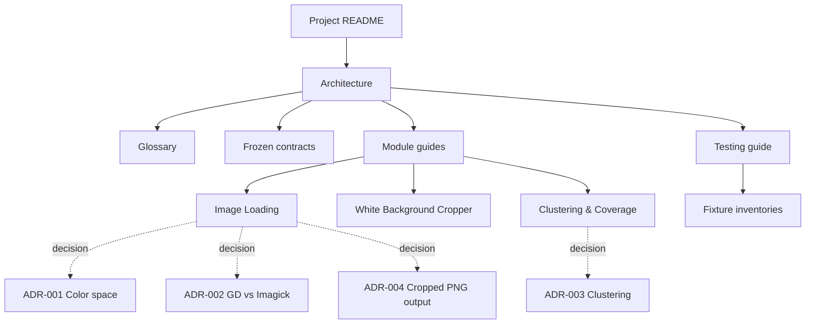

# Documentation

This directory is the knowledge base for **`image-color-analyzer`** — a dependency-light PHP
library that loads a PNG or JPEG, crops the near-white background, and reports each principal
print color with its coverage percentage. Everything here describes the system as it exists.

## Reading order for a new contributor

1. **[Project README](../README.md)** — what the library does, install, and quick start.
2. **[Architecture](architecture.md)** — the pipeline, components, data flow, and design
   principles. Start here to build a mental model.
3. **[Glossary](glossary.md)** — every domain and algorithm term, defined once.
4. The **module guide** for the area you'll work on (see below).
5. The **ADR** behind any decision you intend to change.

## Map of the suite

### Start here

| Document | What it covers |
|---|---|
| [Architecture](architecture.md) | System overview: purpose, pipeline, components, data flow, design principles, constraints, error handling, and the module-ownership model. |
| [Glossary](glossary.md) | Authoritative definitions of color-science, image-model, clustering, and process terms. |

### Reference

| Document | What it covers |
|---|---|
| [Frozen contracts](contracts.md) | The interfaces and DTOs that form the integration seams, and the policy for changing them. |
| [Image Loading & Color Foundations](modules/image-loading.md) | Contracts, options, exceptions, decoding, color conversion, and the facade. |
| [White Background Cropper](modules/white-background-cropper.md) | Border-inward near-white cropping, tuning, and edge cases. |
| [Color Clustering & Coverage](modules/color-clustering-and-coverage.md) | Histogram binning, k-means++, `k` selection, merging, and coverage math. |

### Decisions (ADRs)

| Document | Decision |
|---|---|
| [ADR-001](ADR-001-color-space.md) | Analyze in CIELAB rather than sRGB or HSV. |
| [ADR-002](ADR-002-gd-vs-imagick.md) | GD as the default image driver; Imagick as an optional adapter. |
| [ADR-003](ADR-003-clustering.md) | k-means++ over a weighted histogram, with automatic `k`. |
| [ADR-004](ADR-004-cropped-image-output.md) | Add new processed-result methods with canonical cropped PNG bytes while preserving legacy JSON. |

### Testing

| Document | What it covers |
|---|---|
| [Testing guide](testing.md) | The automated test strategy and a manual real-image walkthrough. |
| [Fixture inventory](../tests/Fixtures/README.md) | Synthetic and real test images and their expected results. |
| [Cropper fixtures](../tests/Fixtures/real/README.md) | Bordered images used by the cropper's real-image integration tests. |

### Contributing

| Document | What it covers |
|---|---|
| [CONTRIBUTING](../CONTRIBUTING.md) | Branching, commits, pull requests, the frozen-contract change policy, and local checks. |

## How the documents relate

