# Architecture Overview

## Purpose

`image-color-analyzer` is a dependency-light PHP library that answers one question about an
image: **which principal colors does it contain, and in what proportions?** It loads a PNG
or JPEG, removes the surrounding near-white background, groups the remaining colors into a
handful of representative "principal print colors," and reports each with a coverage
percentage. The output is a small, sorted JSON array designed to be consumed by another
system — typically a print or pre-press pipeline.

```json
[
  { "color": "#FF0000", "coverage_percent": 42.5 },
  { "color": "#0000FF", "coverage_percent": 31.2 },
  { "color": "#00FF00", "coverage_percent": 26.3 }
]
```

This document is the map of the system: how the pieces fit, why they are shaped the way
they are, and what a contributor should understand before changing any of them. For term
definitions, see the [Glossary](glossary.md); for exact interface signatures, see the
[Frozen contracts](contracts.md).

## The pipeline at a glance

The library is a **one-directional pipeline** of small components, each hidden behind a
stable interface. Data flows in a single direction and each stage transforms one immutable
value into the next.

```mermaid
flowchart LR
    S([source:<br/>path · stream · bytes · GD image]) --> R[SourceResolver]
    R --> L[ImageLoader<br/>GD / Imagick]
    L -->|Raster| C[WhiteBackgroundCropper]
    C -->|cropped Raster| H[ColorHistogram]
    H -->|weighted bins| K[KMeansClusterer<br/>k-means++ in CIELAB]
    K -->|ClusterResult| V[PercentageCoverageCalculator]
    V -->|ColorCoverage&#91;&#93;| O([JSON / array])
```



Every arrow is a **frozen DTO**, so a stage only needs to understand the value it receives,
never the internals of the stage that produced it. The `ImageColorAnalyzer` facade owns the
sequencing; the individual stages never call one another directly.

## Core components and responsibilities

Each stage maps to a documented module. The table links the responsibility to the code and
to the in-depth module guide.

| Stage | Responsibility | Key classes | Module guide |
|---|---|---|---|
| **Source resolution** | Accept a path, stream, raw bytes, or GD image; sniff PNG/JPEG from magic bytes; normalize to an `ImageSource`. | `SourceResolver`, `FileImageSource` | [Image Loading](modules/image-loading.md) |
| **Image loading** | Decode with GD (default) or Imagick (optional); normalize palette/grayscale to truecolor; expand alpha to 0–255; reject CMYK JPEG and oversized images. | `GdImageLoader`, `ImagickImageLoader`, `InMemoryRaster` | [Image Loading](modules/image-loading.md) |
| **Color conversion** | Provide sRGB ↔ XYZ ↔ CIELAB and HSV conversions plus ΔE distance — the shared math for cropping and clustering. | `ColorConverter` | [Image Loading](modules/image-loading.md) |
| **Background cropping** | Trim the near-white / transparent border with a border-inward scan, judged in CIELAB. | `WhiteBackgroundCropper` | [White Background Cropper](modules/white-background-cropper.md) |
| **Clustering** | Bin pixels into a weighted histogram, then group them with deterministic k-means++ in CIELAB and merge near-duplicates. | `ColorHistogram`, `KMeansClusterer`, `WeightedKMeans`, `KSelector` | [Clustering & Coverage](modules/color-clustering-and-coverage.md) |
| **Coverage** | Convert cluster weights into percentages that sum to exactly `100.0`. | `PercentageCoverageCalculator` | [Clustering & Coverage](modules/color-clustering-and-coverage.md) |
| **Facade** | Wire the stages, resolve options, expose `analyze*()`, serialize JSON. | `ImageColorAnalyzer`, `AnalyzerFactory` | this document |

## Data flow, step by step

1. **Resolve.** `SourceResolver` turns whatever the caller passed — a filesystem path, an
   `fopen` handle, a `php://` stream, raw image bytes, or a GD image — into an `ImageSource`
   whose format has been detected from magic bytes. A plain string is always treated as raw
   bytes, never as a path; filesystem access goes exclusively through `analyzePath()` /
   `resolvePath()`.
2. **Load.** The loader decodes the bytes into an immutable `Raster` of `ColorRGBA` pixels,
   normalizing palette and grayscale images to truecolor and converting GD's inverted 7-bit
   alpha to a 0–255 channel. Undecodable input raises `InvalidImageException`; CMYK JPEG and
   oversized images raise `UnsupportedImageException`.
3. **Crop.** `WhiteBackgroundCropper` scans inward from the four edges and returns the
   smallest rectangle containing all non-background content. Because it only moves edges
   toward the center, it can never remove legitimate white *inside* the artwork.
4. **Bin.** `ColorHistogram` reduces the cropped raster to a weighted color histogram,
   skipping transparent pixels. This is the single full-image pass in the clustering path.
5. **Cluster.** `KMeansClusterer` projects each bin to CIELAB, runs deterministic k-means++
   (with `KSelector` choosing `k` when it is not fixed), then merges clusters that are
   perceptually close or below the coverage floor.
6. **Measure.** `PercentageCoverageCalculator` turns cluster weights into one-decimal
   percentages using the largest-remainder method and sorts them by coverage descending.
7. **Serialize.** The facade returns a `list<array{color, coverage_percent}>`; the
   `*AsJson` variants encode it as pretty JSON, preserving whole numbers as floats
   (`50.0`, not `50`).

## Design principles

- **Interface-first.** Every stage is defined by an interface and communicates through
  immutable DTOs (`Raster`, `ColorRGBA`, `ClusterResult`, `ColorCoverage`). Components never
  reach into each other's internals. This is what made independent, parallel development of
  the modules safe, and it is what lets the GD loader be swapped for Imagick without
  touching anything downstream.
- **Driver abstraction for image I/O.** GD is the default decoder; an Imagick adapter can be
  dropped in behind the same `ImageLoaderInterface`. See [ADR-002](ADR-002-gd-vs-imagick.md).
- **Perceptual analysis in CIELAB.** Both "is this pixel white?" and "are these two colors
  similar?" are judged in CIELAB, where distance tracks human perception. See
  [ADR-001](ADR-001-color-space.md).
- **Resolution independence.** Clustering never runs on raw pixels. Pixels are reduced to a
  weighted histogram first, so a 20-megapixel scan and a 500-pixel thumbnail of the same
  artwork cost roughly the same to cluster and yield comparable results. A performance
  regression test guards this property.
- **Determinism.** Seeded k-means++ and deterministic tie-breaking make the output a pure
  function of `(pixels, options)`. No global RNG state is touched. Determinism is what makes
  the results testable.
- **Pure library.** No global state, no output, no `exit`, no CLI assumptions. Every
  component is injectable and unit-testable, and errors are communicated through a typed
  exception hierarchy rather than warnings.

## Configuration model

Behavior is tuned through three immutable option objects, all optional — the defaults are
production-ready.

- `CropOptions` — near-white thresholds and the noise guard for the cropper.
- `ClusterOptions` — histogram resolution, `k` selection, merge thresholds, and the seed.
- `AnalyzerOptions` — a container pairing a `CropOptions` with a `ClusterOptions`, passed to
  `analyze()` and forwarded to the relevant stage.

Defaults and tuning guidance live in the module guides ([cropper](modules/white-background-cropper.md),
[clustering](modules/color-clustering-and-coverage.md)); the exact fields are listed in
[contracts.md](contracts.md).

## Cross-cutting constraints

- **Memory.** The default `InMemoryRaster` holds every decoded pixel in PHP memory. The
  `maxPixels` guard (64 million by default) rejects images that would exhaust it *before*
  allocation. For very large images, downscale before analysis, or supply a streaming
  `Raster` implementation. Clustering itself is bounded by the histogram, not the pixel
  count.
- **Formats.** Only 8-bit PNG and JPEG are supported by the default GD driver. CMYK JPEG is
  explicitly rejected (route it through the optional Imagick loader). 16-bit and ICC-aware
  handling are out of scope for GD.
- **Lossy input.** JPEG compression can introduce faint edge colors. Histogram binning and
  the merge/low-coverage passes fold most of them away, but a large, sharp color boundary
  may still leave a small (~1%) artifact color.
- **PHP version.** PHP ≥ 8.2 with `ext-gd`. The optional Imagick adapter requires
  `ext-imagick`.

## Error handling

All failures are typed and share the `ImageAnalyzerException` marker interface, so a caller
can catch every library error with a single `catch`:

| Exception | Raised when |
|---|---|
| `InvalidImageException` | Bytes are not a decodable image, or metadata cannot be read. |
| `UnsupportedImageException` | Format is recognized but unsupported by the driver — CMYK JPEG, non-PNG/JPEG, or an image exceeding `maxPixels`. |
| `NotImplementedException` | A scaffold marker for intentionally unimplemented paths (`LogicException`). |

The library never emits PHP warnings for malformed input; GD's native warnings are
suppressed and translated into these exceptions.

## Ownership model

The codebase was built by a three-person team with disjoint directory ownership, which is
why the module guides are organized the way they are. Ownership is retained here for
historical context; the interfaces, not the people, are the real boundaries.

| Original owner | Modules | Documentation |
|---|---|---|
| **Developer A** | Contracts, options, exceptions, image loading, color conversion, the facade skeleton, and tooling/CI | [Image Loading & Color Foundations](modules/image-loading.md) |
| **Developer B** | White-background cropper | [White Background Cropper](modules/white-background-cropper.md) |
| **Developer C** | Histogram, clustering, coverage, examples | [Color Clustering & Coverage](modules/color-clustering-and-coverage.md) |

## Project layout

```
src/
  Contracts/              # frozen interfaces + DTOs (the integration seams)
  Options/                # CropOptions, ClusterOptions, AnalyzerOptions
  Exception/              # typed exception hierarchy
  ImageLoader/            # GD loader, Imagick adapter, SourceResolver, InMemoryRaster
  Color/                  # ColorConverter: sRGB <-> Lab <-> HSV, ΔE
  WhiteBackgroundCropper/ # near-white, border-inward crop
  ColorClusterer/         # histogram + k-means++ + k selection + merge
  CoverageCalculator/     # coverage percentages, largest-remainder rounding
  PublicAPI/              # ImageColorAnalyzer facade + AnalyzerFactory
tests/                    # Unit, Integration, Support (fakes + synthetic factory), Fixtures
examples/                 # runnable analyze_from_path.php / analyze_from_handle.php
docs/                     # this knowledge base
```

## Related documents

- [Documentation index](README.md) — the full map of the docs suite.
- [Frozen contracts](contracts.md) — exact interfaces and DTOs.
- [ADR-001](ADR-001-color-space.md) · [ADR-002](ADR-002-gd-vs-imagick.md) · [ADR-003](ADR-003-clustering.md) — the decisions behind this architecture.
- [Testing guide](testing.md) — how the guarantees above are verified.
